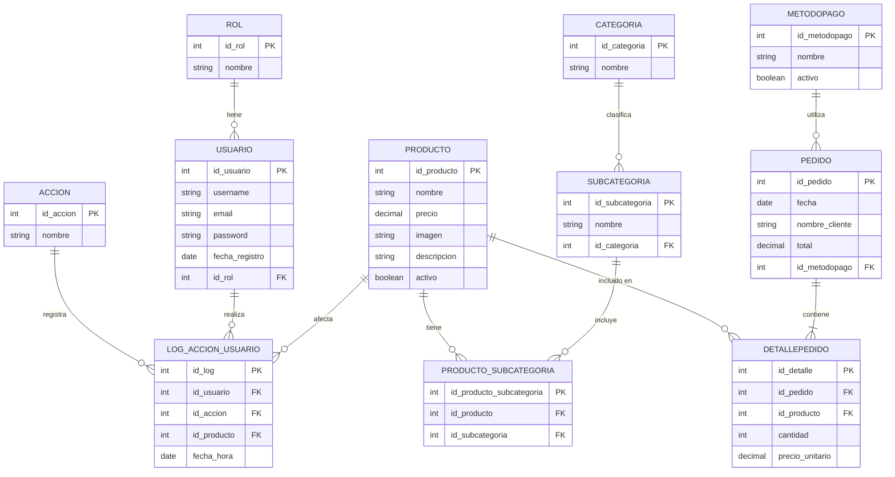

# Pick&Play

Sistema de autoservicio para alquiler de juegos de mesa y cartas en bares y cafeterías.

## Tabla de Contenidos
- [Características principales](#características-principales)
- [Tecnologías utilizadas](#tecnologías-utilizadas)
- [Arquitectura general](#arquitectura-general)
- [Backend](#backend)
- [Frontend](#frontend)
- [Estructura de carpetas](#estructura-de-carpetas)
- [Diagrama Entidad-Relación (DER)](#diagrama-entidad-relación-der)
- [Flujo de uso típico](#flujo-de-uso-típico)
- [Ejemplos de endpoints de la API](#ejemplos-de-endpoints-de-la-api)
- [Instalación y despliegue](#instalación-y-despliegue)
- [Autores](#autores)

---

## Características principales
- Catálogo de productos (juegos de mesa y cartas) con imágenes y descripciones.
- Pedidos online desde la mesa del cliente.
- Gestión de usuarios y roles (root, repositor, analista).
- Panel de administración con CRUD de productos, usuarios, categorías, subcategorías y métodos de pago.
- Auditoría de acciones y estadísticas de uso.
- Interfaz moderna y responsiva (Bootstrap 5).
- Seguridad con JWT y roles.

## Tecnologías utilizadas
- Node.js, Express, Sequelize, Docker
- MySQL
- Bootstrap 5, HTML5, CSS3, JavaScript

---

## Arquitectura general
Pick&Play está compuesto por dos grandes módulos:
- **Backend:** API RESTful en Node.js/Express, con persistencia en MySQL y autenticación JWT.
- **Frontend:** Aplicación web estática (HTML/CSS/JS) dividida en vista pública y panel de administración.

La comunicación entre frontend y backend se realiza vía HTTP (fetch/AJAX), siguiendo buenas prácticas de seguridad y separación de responsabilidades.

---

## Backend
El backend es una API RESTful desarrollada en Node.js con Express y Sequelize. Gestiona la lógica de negocio, autenticación, autorización por roles, auditoría y persistencia de datos en MySQL.

- **Estructura modular:**
  - `controllers/`: Lógica de endpoints y validaciones.
  - `models/`: Modelos Sequelize para entidades como Usuario, Producto, Pedido, etc.
  - `routes/`: Definición de rutas y middlewares.
  - `middlewares/`: Autenticación JWT, control de roles, auditoría, subida de imágenes.
  - `services/`: Lógica de negocio reutilizable.
  - `seeders/`: Scripts para poblar la base de datos con datos iniciales.
  - `config/`: Configuración de base de datos y entorno.

- **Principales endpoints:**
  - `/api/productos`, `/api/usuarios`, `/api/pedidos`, `/api/categorias`, `/api/subcategorias`, `/api/metodosPago`, `/api/auth`, `/api/auditoria`, etc.

- **Seguridad:**
  - Autenticación con JWT.
  - Control de acceso por roles (root, repositor, analista).
  - Auditoría de acciones administrativas.

- **Relaciones y modelos:**
  - Usuarios y roles (RBAC)
  - Productos, categorías, subcategorías (N:M)
  - Pedidos y detalles de pedido
  - Métodos de pago
  - Logs de auditoría

- **Auditoría:**
  - Todas las acciones administrativas relevantes quedan registradas en la base de datos.

---

## Frontend
El frontend es una aplicación web estática dividida en dos grandes áreas:

- **Vista pública (cliente):**
  - Ubicada en `frontend/html/views/`.
  - Permite a los clientes ver el catálogo, seleccionar productos y realizar pedidos desde la mesa.
  - Interfaz responsiva y amigable, pensada para tablets o móviles.
  - Uso de Bootstrap 5 y JavaScript puro para la interacción.
  - Flujo: selección de productos → carrito → confirmación de pedido → ticket.

- **Panel de administración:**
  - Ubicado en `frontend/html/admin/`.
  - Acceso restringido a usuarios autenticados (root, repositor, analista).
  - Permite gestionar productos, usuarios, categorías, subcategorías, métodos de pago, ver auditoría y estadísticas.
  - CRUD completo y visualización de informes.
  - Scripts modulares para cada entidad y funcionalidad.

- **Estructura de carpetas:**
  - `css/`: Estilos organizados por área (admin/base/views).
  - `js/`: Scripts modulares para cada vista y funcionalidad.

---

## Estructura de carpetas
```
backend/
  src/
    controllers/
    models/
    routes/
    middlewares/
    services/
    seeders/
    config/
frontend/
  html/
    views/
    admin/
  css/
    base/
    admin/
    views/
  js/
    core/
    views/
    admin/
```

---

## Diagrama Entidad-Relación (DER)
A continuación se muestra el diagrama entidad-relación (DER) del sistema, generado con Mermaid. Puedes visualizarlo directamente en GitHub o usando cualquier visor compatible con Mermaid.

> El archivo fuente editable está disponible en [`der.mmd`](./der.mmd) en la raíz del repositorio.



---

## Flujo de uso típico
1. El cliente ingresa su nombre y realiza un pedido desde la web pública.
2. El pedido se almacena y puede ser gestionado por el admin.
3. El admin accede al dashboard, gestiona productos, usuarios, ve auditoría y estadísticas.
4. Todas las acciones relevantes quedan registradas para auditoría.

---

## Instalación y despliegue

Sigue los pasos en [`GUÍA_DE_USO.md`](/docs/GUIA_DE_USO.md) para la instalación.

---

## Notas y troubleshooting
- Si hay errores de conexión, revisa las variables de entorno y la base de datos.
- Para restablecer datos, puedes volver a correr los seeders (`npm run seed`).
- Si necesitas desactivar el teclado virtual para testear en PC, usa el atajo `Ctrl+Alt+K` en la pantalla de inicio.

## Autores
- Iván Fernández
- Luciano Fattoni


