# Guía de Uso - Pick&Play

## ¿Qué es Pick&Play?
Pick&Play es un sistema de autoservicio para alquiler de juegos de mesa y cartas, pensado para funcionar en bares, cafeterías o espacios lúdicos. Permite a los clientes realizar pedidos desde una interfaz web y a los administradores gestionar el catálogo, usuarios, auditoría y estadísticas desde un panel de administración.

---

## Requisitos previos
- Node.js (v18+ recomendado)
- MySQL (v8+ recomendado)
- Git

---

## Capturas de pantalla principales

### Login de administrador
Pantalla de acceso seguro para administradores y repositores.

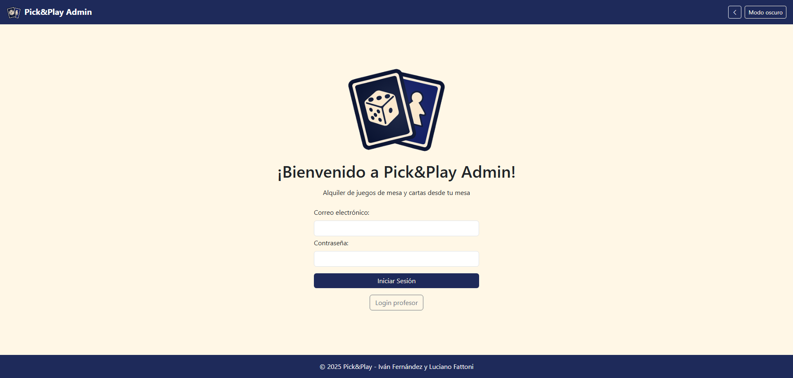

### Dashboard de administración
Vista principal del panel admin, con acceso a gestión de entidades, informes y auditoría.

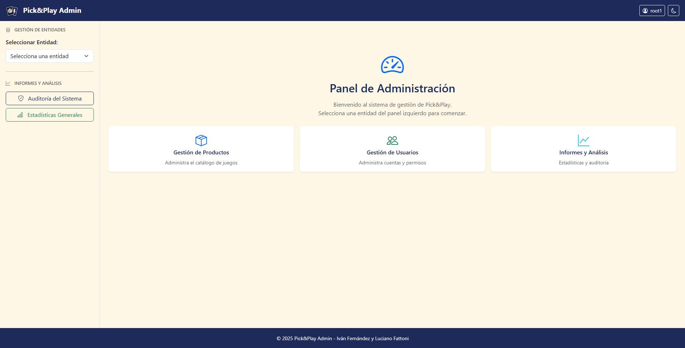

### Listado de productos
Gestión y visualización del catálogo de juegos de mesa y cartas.

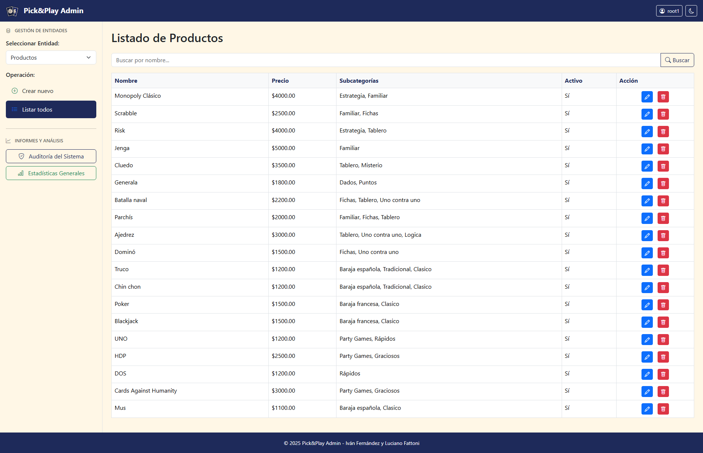

### Alta/edición de producto
Formulario para agregar o modificar productos en el sistema.

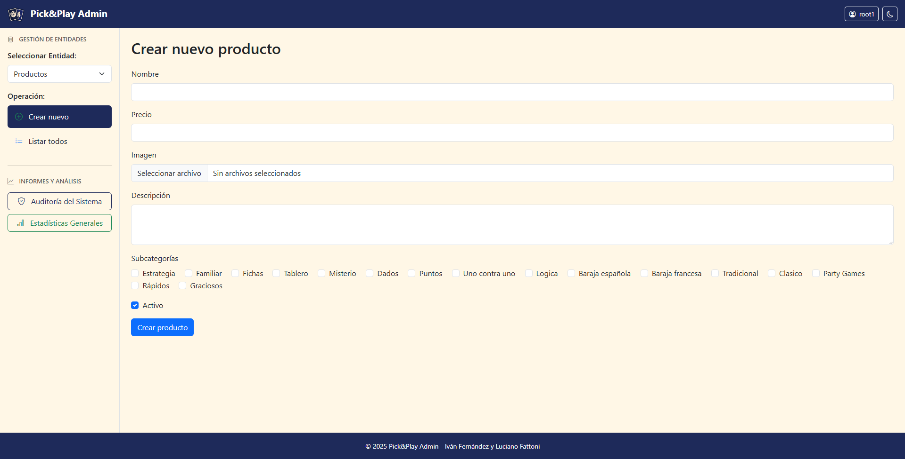

### Auditoría de acciones
Visualización de logs de acciones administrativas para trazabilidad y seguridad.

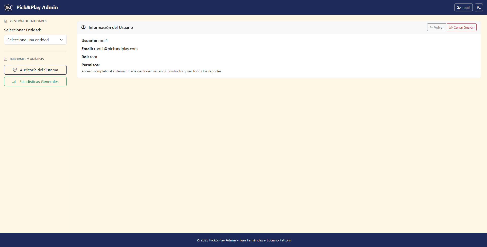

### Estadísticas
Panel de estadísticas generales del sistema.

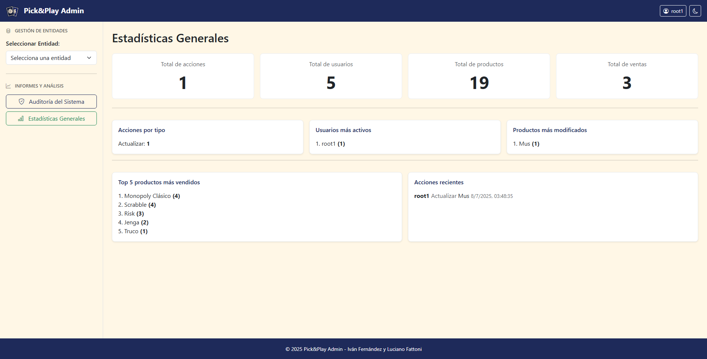

### Vista cliente: inicio y navegación
Pantalla de bienvenida y selección de categorías para el cliente.

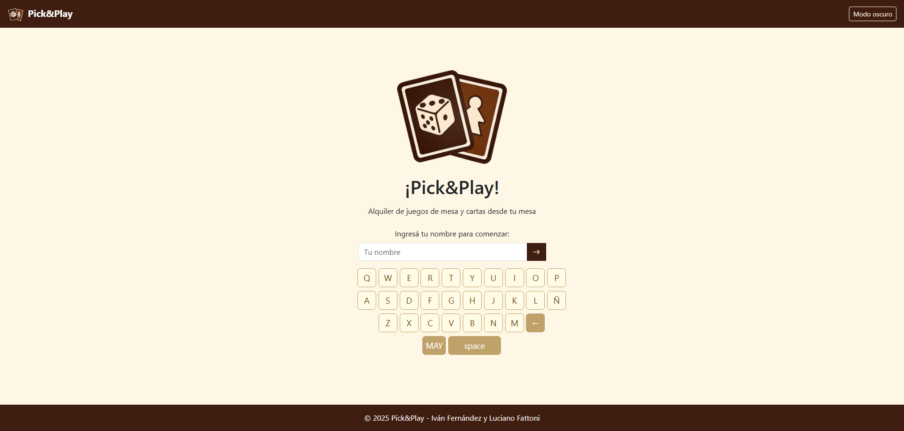
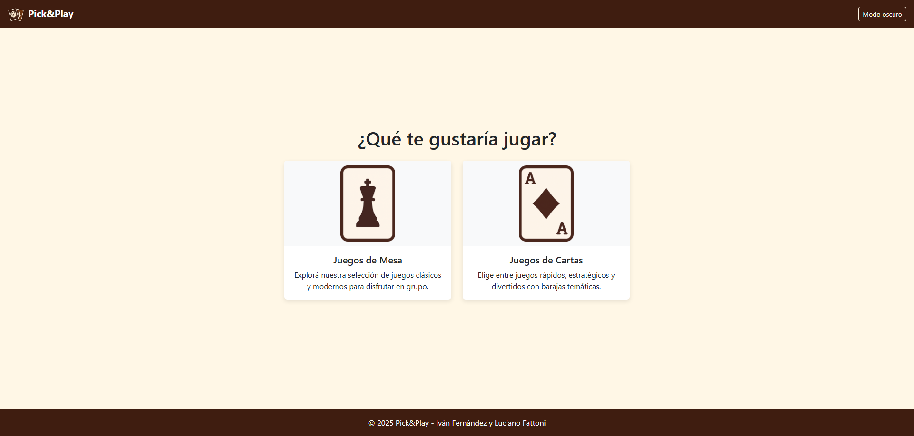

### Vista cliente: productos y carrito
Selección de productos y gestión del carrito de pedidos.

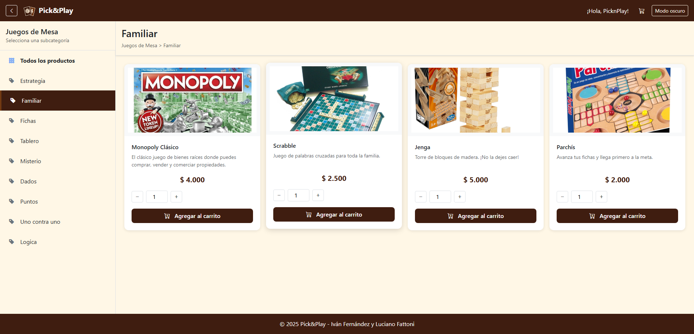
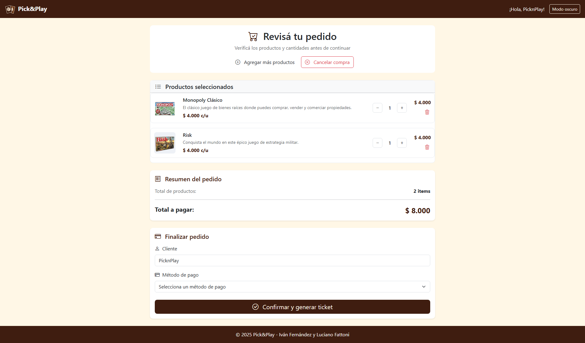

### Ticket de pedido
Visualización y descarga del ticket generado tras confirmar el pedido.

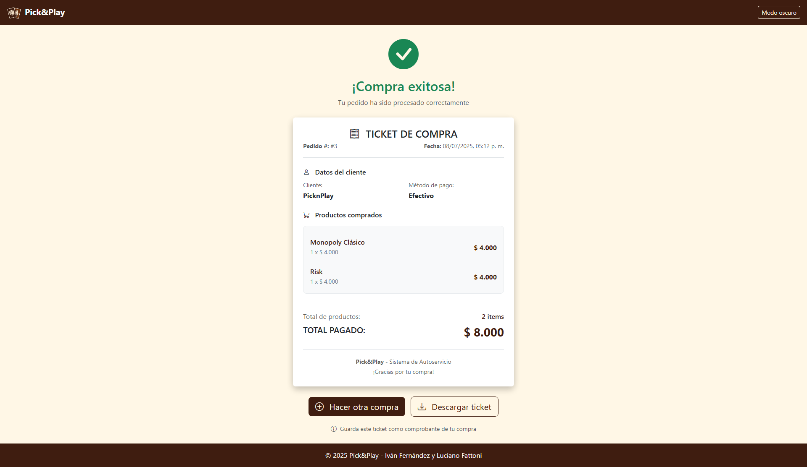

---

## Instalación y configuración
1. **Clona el repositorio:**
   ```bash
   git clone <url-del-repo>
   cd Pick&Play
   ```
2. **Instala dependencias del backend:**
   ```bash
   cd backend
   npm install
   ```
3. **Configura las variables de entorno:**
   - Crea un archivo `.env` en `backend/` con los siguientes datos:
     ```env
     DB_HOST=localhost
     DB_PORT=3306
     DB_NAME=picknplay
     DB_USER=tu_usuario
     DB_PASSWORD=tu_password
     PORT=3000
     JWT_SECRET=un_secreto_seguro
     ```

---

## Inicialización de la base de datos
1. **Crea la base de datos vacía en MySQL:**
   ```sql
   CREATE DATABASE picknplay;
   ```
2. **Ejecuta los seeders para poblar datos iniciales:**
   ```bash
   npm run seed
   ```
   Esto creará roles, usuarios admin, categorías, productos, etc.

---

## Ejecución del backend
- Para desarrollo:
  ```bash
  npm run dev
  ```
- Para producción:
  ```bash
  npm start
  ```

El backend quedará escuchando en el puerto definido en `.env` (por defecto 3000).

---

## Ejecución del frontend
El frontend es estático y se accede abriendo los archivos HTML en `frontend/html/views/` (para clientes) o `frontend/html/admin/` (para administradores) en el navegador. Se recomienda usar una extensión de servidor local (ej: Live Server) o configurar un servidor estático.

---

## Usuarios y roles
- **root**: Acceso total (gestión, auditoría, eliminación).
- **repositor**: Gestión de productos, pedidos, pero sin acceso a todo.
- **analista**: Acceso a informes y estadísticas.
- **cliente**: Solo puede hacer pedidos desde la interfaz pública.

Usuarios admin iniciales se crean con los seeders.

---

## Estructura de carpetas
- `backend/`: API REST, modelos, controladores, seeders, middlewares.
- `frontend/`: HTML, CSS y JS para clientes y admins.

---

## Flujo de uso típico
1. El cliente ingresa su nombre y realiza un pedido desde la web.
2. El pedido se almacena y puede ser gestionado por el admin.
3. El admin accede al dashboard, gestiona productos, usuarios, ve auditoría y estadísticas.

---

## Notas y troubleshooting
- Si hay errores de conexión, revisa las variables de entorno y la base de datos.
- Para restablecer datos, puedes volver a correr los seeders (`npm run seed`).
- Contacto: [@ivnfdzz05](https://github.com/ivnfdzz) · [@luchoFatto](https://github.com/luchoFatto)
